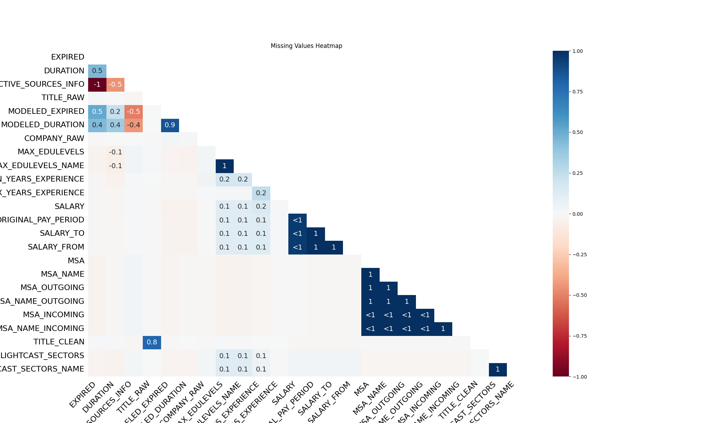

## Introduction

Artificial Intelligence (Al) is rapidly transforming industries, reshaping job roles, and redefining employment patterns. While AI-driven automation raises concerns about job displacement, it also fosters job creation in emerging fields, As AI continues to integrate into various sectors in 2024 and future, understanding its impact on job security is essential. This study examines whether Ar is primarily displacing jobs or generating new opportunities, highlighting industries experiencing AI-driven growth versus those facing employment risks.

## Research Rationale

Recent studies indicate that AI is transforming the job market by automating roles in manufacturing, customer service, and administrative work, leading to job displacement. At the same time, it is driving demand for skilled professionals in AI development, cybersecurity, and data analysis, creating new career opportunities[@perrault2024artificial]. As AI continues to evolve, workers will need to adapt by developing new skills, making AI-focused education and training increasingly essential.
Although AI will displace certain tasks in manufacturing and administrative work it will also lead to the evolution of existing jobs. This has been something that has happened in the past with the evolution of technology and although it led to job displacement it also led to revolutionary strides in the efficiency of work. This in turn leads to economic and job growth which the masses should welcome and not turn away from [@george2024aifuture]. Further not all jobs are replaceable, but they would greatly benefit from shifting to include some level of AI including supply chain, medicine, and manufacturing. With the correct training the transition to include AI will be critical to the shift the world will see as a result.
To navigate AI-driven employment changes, workers must develop new skills to stay competitive.  Reskilling and upskilling initiatives will be essential in equipping individuals with AI-related competencies, enabling them to transition into emerging roles in AI development, data analysis, and automation oversight.  Moreover, rather than fully replacing human labor, AI is expected to enhance productivity through human-AI collaboration, where AI automates repetitive tasks while humans focus on complex problem-solving and strategic decision-making [@idrisi2024ai].  Policymakers and businesses must take proactive steps to support this transition by investing in education, workforce training, and adaptive employment policies that foster a more AI-integrated economy.
This research aims to explore how AI is reshaping employment, balancing job losses with new job creation. The findings will provide valuable insights for businesses, policymakers, and workers, helping them navigate Al-driven changes and prepare for the future workforce. 

## Brief Literature Review

Existing research highlights the growing divide between AI-driven careers and traditional industries.

@perrault2024artificial In 2023, AI-related job postings accounted for 1.6% of all listings in the United States from 2.8% in 2022, This decline is linked to fewer openings from top Al firms and aCOwn.reduced emphasis on tech roles within these companies.

@george2024aifuture The world has had multiple market evolutions including the Industrial Revolution which led to shifts in the machinery used and decreased the need for as many employees working in the fields. The number of employees working in agriculture decreased from 70% of the developed world in the mid-19th cenutry to 2-3% today. This led to an increase in people working in manufacturing to maintain the technology used in agriculture. The world would likely see a similar outcome once AI starts to present in more industries.

@idrisi2024ai Recent studies using Lotka-Volterra equations identify two equilibrium points in AI-driven job displacement: E₁ (0,0), where jobs vanish, and E₂ (s/β, r/α), where AI and employment coexist.  Research suggests that when AI growth exceeds job creation by 20-30%, workforce instability increases, highlighting the need for policy interventions like reskilling programs to maintain balance.


## Trends and Insights From The Lightcast Dataset

```{python}
import ast
import matplotlib.pyplot as plt
import plotly.express as px
import pandas as pd
import missingno as msno
```

### Data Collection & Cleaning

Download a sample of the lightcast dataset from google drive. Load the CSV file into a pandas dataframe.
To improve the quality of our dataset, we removed irrelevant and redundant columns based on the following reasons:

- **Irrelevant columns**:  
  Columns like `ID`, `URL`, `DUPLICATES`, and `LAST_UPDATED_TIMESTAMP` do not provide meaningful insights for our analysis.

- **Multiple versions of NAICS/SOC codes**:  
  The dataset contained multiple versions of industry and occupation codes (e.g., `NAICS_2022_2`, `NAICS_2022_3`, ..., `SOC_2021_2`, `SOC_2021_3`).  
  We kept only the most recent version:  
  - `NAICS_2022_6` (for industry classification)  
  - `SOC_2021_4` (for occupation classification)  
  
```{python}
# Keeping only the latest NAICS_2022_6 and SOC_2021_4 columns

naics_columns = [col for col in df.columns if "NAICS" in col and col != "NAICS_2022_6"]
soc_columns = [col for col in df.columns if "SOC" in col and col != "SOC_2021_4"]
columns_to_drop = naics_columns + soc_columns
columns_to_drop = [col for col in columns_to_drop if col in df.columns]

df.drop(columns=columns_to_drop, inplace=True)

naics_columns_remaining = [col for col in df.columns if "NAICS" in col]
soc_columns_remaining = [col for col in df.columns if "SOC" in col]

print(" Remaining NAICS columns:", naics_columns_remaining)
print("Remaining SOC columns:", soc_columns_remaining)
```

- **How does this improve analysis?**  
  - Reduces data redundancy, making the dataset cleaner and easier to interpret.
  - Ensures that we use consistent classification standards across our analysis.
  - Eliminates unnecessary noise, improving model performance and visualization clarity.

By removing these columns, we streamlined the dataset for accurate insights while maintaining all necessary classification data.

- **Missing Data**  
This step helps in identifying and removing highly incomplete features to improve data quality and analysis reliability. We visualize it using heat map.
```{python}
df = pd.read_csv('./data/lightcast_job_postings.csv')
msno.heatmap(df)
plt.title("Missing Values Heatmap")

# Drop columns with >50% missing values
df.dropna(thresh=len(df) * 0.5, axis=1, inplace=True)

plt.savefig("figures/heatmap.png")
plt.show()
```

```{=html}



```
Using cleaned datas to conduct analysis.
```{python}
df = pd.read_csv("data/cleaned_data.csv")
df.head()
```


Here, we focus on full-time in-office non-internship roles.

### Identifying AI and Non-AI Jobs

We identify AI/non-AI jobs by keyword searching.

```{python}
keywords = ['AI', 'Artificial Intelligence', 'Machine Learning', 'Deep Learning',
            'Data Science', 'Data Analysis', 'Data Analyst', 'Data Analytics',
            'LLM', 'Language Model', 'NLP', 'Natural Language Processing',
            'Computer Vision']

match = lambda col: df[col].str.contains('|'.join(keywords), case=False, na=False)

df['AI_JOB'] = match('TITLE_NAME') \
             | match('SKILLS_NAME') \
             | match('SPECIALIZED_SKILLS_NAME') \
             | match('LIGHTCAST_SECTORS_NAME')
```

### Trend 1: AI vs. Non-AI Job Across Industries

We first compare the number of AI and Non-AI jobs across all industries.

```{python}

df_grouped = df.groupby(['AI_JOB', 'NAICS2_NAME']).size().reset_index(name='Job_Count')

px.bar(df_grouped, x='NAICS2_NAME', y='Job_Count', color='AI_JOB',
       title="AI vs. Non-AI Job Distribution Across Industries",
       labels={'NAICS2_NAME': 'Industry', 'Job_Count': 'Number of Jobs'},
       barmode='group')
```

```{=html}
<iframe src="./figures/grouped_bar.html" width="750" height="600"></iframe>

```
As we can see, there are almost always more AI jobs than non-AI jobs.

### Trend 2: AI-driven Job Growth vs. Job Displacement

Now we turn out eyes to job growth and job displacement.

```{python}
df_grouped = df.groupby(['POSTED', 'AI_JOB']).size().reset_index(name='Job_Count')
fig = px.line(df_grouped, x='POSTED', y='Job_Count', color='AI_JOB',
              title="AI vs. Non-AI Job Posted Over Time",
              labels={'POSTED': 'Month', 'Job_Count': 'Number of Job Postings'},
              markers=True)
fig.write_html("figures/2_chart.html")

```

```{=html}
<iframe src="figures/2_chart.html" width="750" height="600"></iframe>

```
Overall, there are more newly posted AI jobs than non-AI jobs.

```{python}
df_grouped = df.groupby(['AI_JOB', 'MIN_YEARS_EXPERIENCE']).size().reset_index(name='Job_Count')

fig = px.bar(df_grouped, x='MIN_YEARS_EXPERIENCE', y='Job_Count', color='AI_JOB',
            title="AI vs. Non-AI Jobs by Minimum Years of Experience",
            labels={'MIN_YEARS_EXPERIENCE': 'Min Years of Experience', 'Job_Count': 'Number of Jobs'},
            barmode='group')
fig.write_html("figures/3_chart.html")
```

```{=html}
<iframe src="figures/3_chart.html" width="750" height="600"></iframe>

```

```{python}
df_grouped = df[df['SALARY'].notna()].groupby(['AI_JOB', 'MIN_YEARS_EXPERIENCE'])['SALARY'].mean().reset_index()

fig = px.bar(df_grouped, x=['AI_JOB', 'MIN_YEARS_EXPERIENCE'], y='SALARY',
             title="Average Salary: AI vs. Non-AI Jobs",
             labels={'AI_JOB': 'Job Type', 'SALARY': 'Average Salary'},
             color='AI_JOB')
fig.write_html("figures/4_chart.html")
```

```{=html}
<iframe src="figures/4_chart.html" width="750" height="600"></iframe>

```

Further investigate into the required YoE of the posted jobs,
one can see that AI jobs generally require less experience than traditional non-AI ones.
In other words, AI related industry demands more junior roles and less senior roles compared to the traditional industry

### Trend 3: Skill in AI Roles vs. Traditional Roles

As we have seen, nearly every industry now requires a significant number of AI roles.
One might interest in what are the valuable skills workers should develop to land in an AI job?

```{python}
import ast
df['SKILLS'] = df['SKILLS_NAME'].apply(ast.literal_eval)

ai_skills = df[df['AI_JOB']]['SKILLS'].explode().value_counts().head(20).reset_index()
ai_skills.columns = ['Skill', 'Count']

fig = px.bar(ai_skills, x='Skill', y='Count',
             title="Top AI Job Skills",
             labels={'Skill': 'Skill Name', 'Count': 'Frequency'},
             color='Skill')
fig.write_html("figures/5_chart.html")
```

```{=html}
<iframe src="figures/5_chart.html" width="750" height="600"></iframe>

```
```{python}
traditional_skills = df[~df['AI_JOB']]['SKILLS'].explode().value_counts().head(20).reset_index()
traditional_skills.columns = ['Skill', 'Count']


fig = px.bar(traditional_skills, x='Skill', y='Count',
             title="Top Traditional Job Skills",
             labels={'Skill': 'Skill Name', 'Count': 'Frequency'},
             color='Skill')
fig.write_html("figures/6_chart.html")
```

```{=html}
<iframe src="figures/6_chart.html" width="750" height="600"></iframe>
```
As we can see, data sciene skills e.g. (SQL, data analysis, and programming) are favorable in AI related jobs.
In the contrary, traditional jobs value candidates with strong communication and management skills.

### Trend 4: Emerging AI Job

While many traditional jobs are in the process of adopting AI-related technologies.
There are many AI jobs emerging.

We note that **Data Analyst** is the fastest growing AI job.

```{python}
job_titles = df[df['AI_JOB']]['TITLE_NAME'].value_counts().head(20).reset_index()
job_titles.columns = ['Job_Title', 'Count']

px.bar(job_titles, x='Job_Title', y='Count',
       title="Top Emerging AI Job Titles",
       labels={'Job_Title': 'Job Title', 'Count': 'Frequency'},
       color='Job_Title')
fig.write_html("figures/7_chart.html")
```

```{=html}
<iframe src="figures/7_chart.html" width="750" height="600"></iframe>
```
## References


